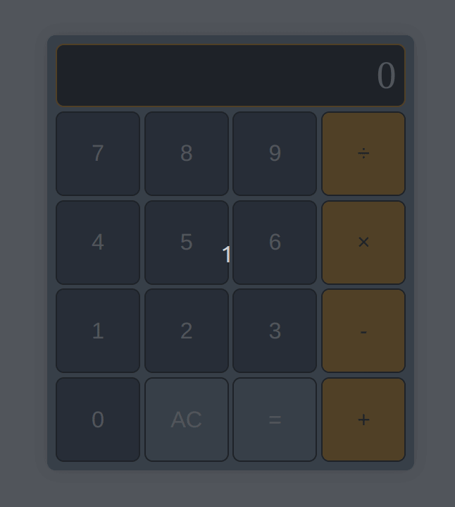

# Yet Another Web Calculator
Now in retro-gold!

## Background

This project was made for the Odin Project's final lesson in the [Foundations course][1].

## What I learned

Making a calculator is, as one would expect, not exactly easy, but the amusing part is that the
whole "math" part of making a calculator with HTML, CSS, and JavaScript is the easy part. The hard
part is getting the buttons and "flowchart" of the whole thing to work as one would expect.

As intended by the authors of TOP, this project tested all the skills I had been reviewing up until
this point in the Foundations course. The easiest part was setting up the HTML. The CSS, especially
where centering the calculator was concerned, was unexpectedly more of a challenge than I thought
it would be, as the "correct" solution wasn't apparent. I eventually realized that there wasn't
any one "correct" solution in that regard.

Similarly, capturing and manipulating the DOM was challenging, but in a fun way -- I now feel like
I understand how Javascript actually interacts with the browser better; prior to this, I simply
did whatever I knew worked without thinking too hard about why.

I also made better use of documentation (like MDN's). For example, YAWC originally iterated over
each of the buttons through a `for` loop, accessing each button in the list by index. This works fine,
but I figured there must be a more "native" way. Turns it, there was: by looking up what
`querySelectorAll()` returns (a NodeList), I was able to then look up any native methods it had --
in this case, `NodeList.forEach()` worked great for my needs. In practice, it did the same thing,
but in a more readable way.

Additionally, I put my current git skills to full use, often branching and sometimes experimenting
with rebasing. Compared to some of my older work, I think the commit log for YWAC is more useful to
readers, especially myself.

## Potential Updates
The following features may or may not be added in the feature:

- Allow the user to enter decimal numbers
- Allow the user to backspace
- Allow the user to use YWAC with just the keyboard, if desired (numpad support)

[1]: https://www.theodinproject.com/lessons/foundations-calculator